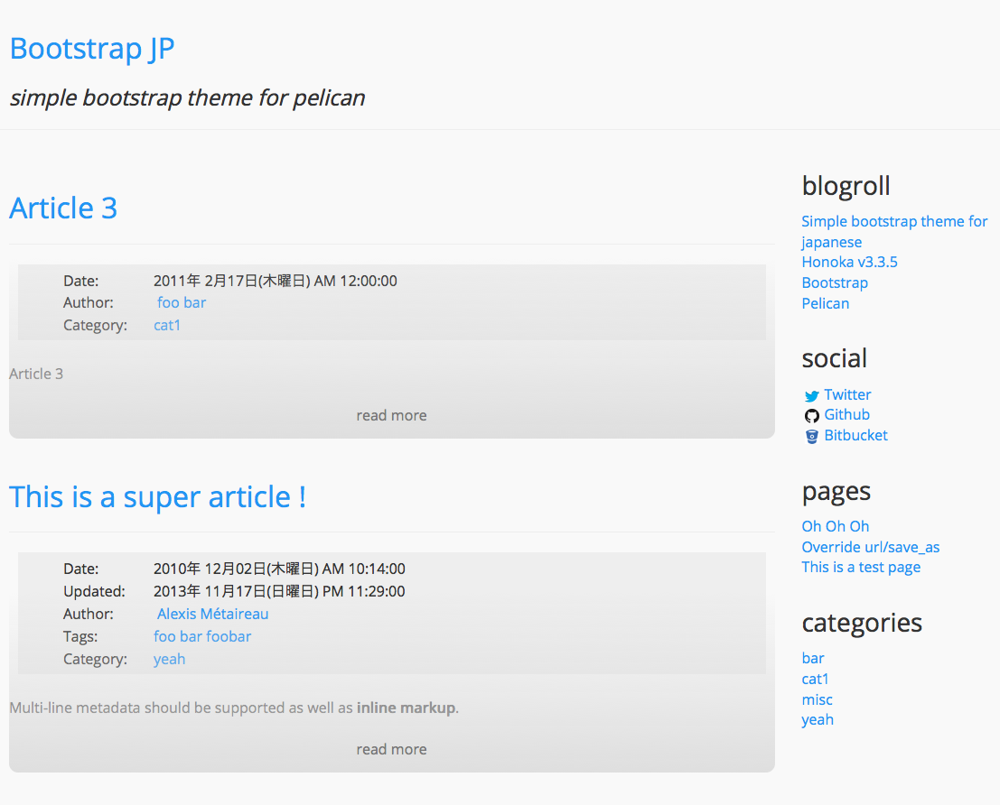
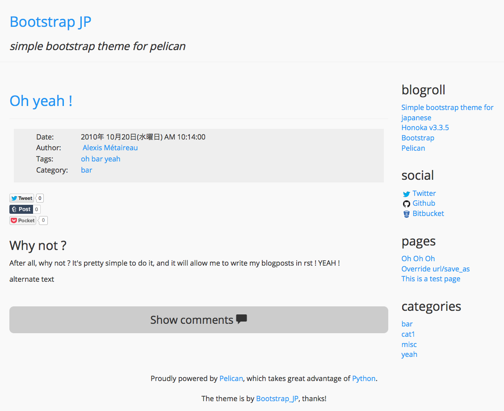

# bootstrap_jp

bootstrap_jp is a simple bootstrap theme for pelican.

Inspired by

* [Coding An HTML 5 Layout From Scratch – Smashing Magazine](http://www.smashingmagazine.com/2009/08/04/designing-a-html-5-layout-from-scratch/ "Coding An HTML 5 Layout From Scratch – Smashing Magazine")

Using a original bootstrap theme. (Product for Japanese)

* [windyakin/Honoka](https://github.com/windyakin/Honoka "windyakin/Honoka")

# features

* Responsive disign
* Disqus commenting
* Google Analytics
* Social button
* Syntax highlighting for code blocks

If you want to extend the python's [Markdown](https://pypi.python.org/pypi/Markdown "Markdown 2.6.2 : Python Package Index").

```
$ pip install mdx_del_ins
```

Add to pelicanconf.py

```
MD_EXTENSIONS = ['del_ins', 'fenced_code', 'codehilite(css_class=highlight)', 'tables']
```

Then you can use GFM like syntax!

# variables for pelicanconf.py

```
LINKS = (('Simple bootstrap theme for japanese', '#'),
         ('Honoka v3.3.5', 'https://github.com/windyakin/Honoka'),
         ('Bootstrap', 'http://getbootstrap.com/'),
         ('Pelican', 'https://github.com/getpelican/pelican'))

TWITTER_USERNAME = 'username' # (default: False)
HATENA_SHARE = True           # or False (default: False)
FACEBOOK_APPID = 'your id'    # (default: False)
GOOGLEPLUS_SHARE = True       # or False (default: False)
POCKET_SHARE = True           # or False (default: False)
TUMBLR_SHARE = True           # or False (default: False)

SOCIAL = [('Twitter', 'https://twitter.com/username'),
          ('Github', 'https://github.com/username'),
          ('Bitbucket', 'https://bitbucket.org/username')]

DISQUS_SITENAME = "your site name"
GOOGLE_ANALYTICS = "your id"
```

# demo


---





